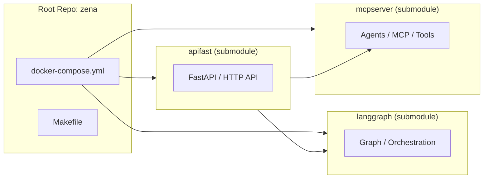
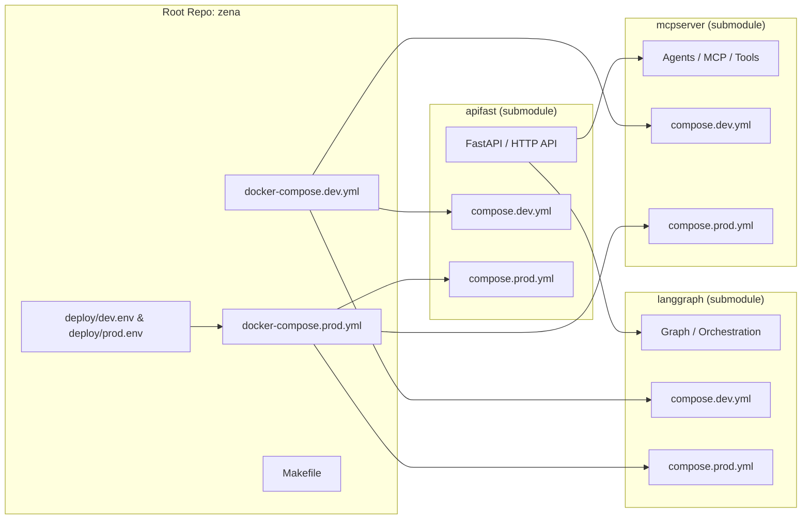
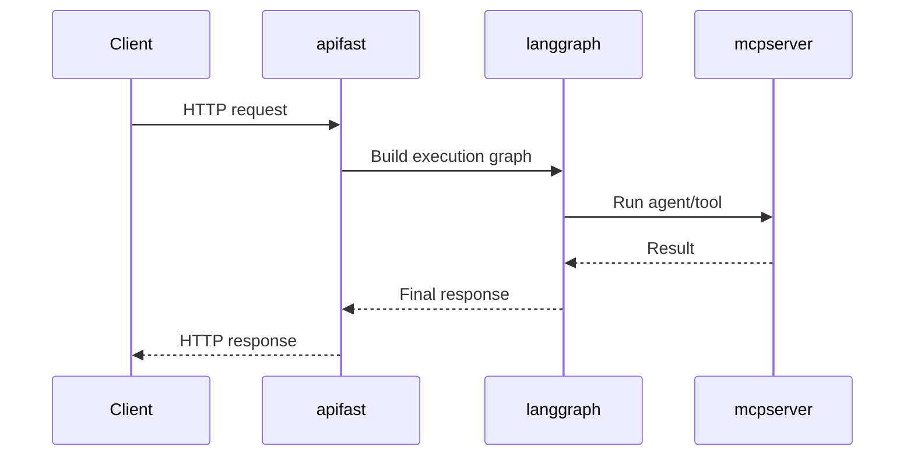

---

# 🧪 Dev vs Prod на одной машине: порты, проекты, compose

Цель: запускать **DEV и PROD одновременно** на одном Docker-хосте без конфликтов.

## ✅ Принцип

- Внутренний порт контейнера **не меняем** (например `3024`).
- Внешний порт хоста **параметризуем** через переменную, например `${APIFAST_PORT}`.
- Запускаем dev и prod как **разные compose-проекты** через `-p`:
  - `-p zena-dev`
  - `-p zena-prod`

Так контейнеры, сети, volume и имена будут разделены на уровне Docker Compose.

---

## 1) Порты: как задавать правильно

В compose у сервиса:

```yaml
ports:
  - "${APIFAST_PORT}:3024"
