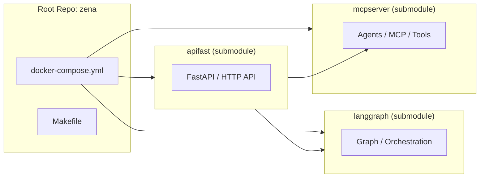
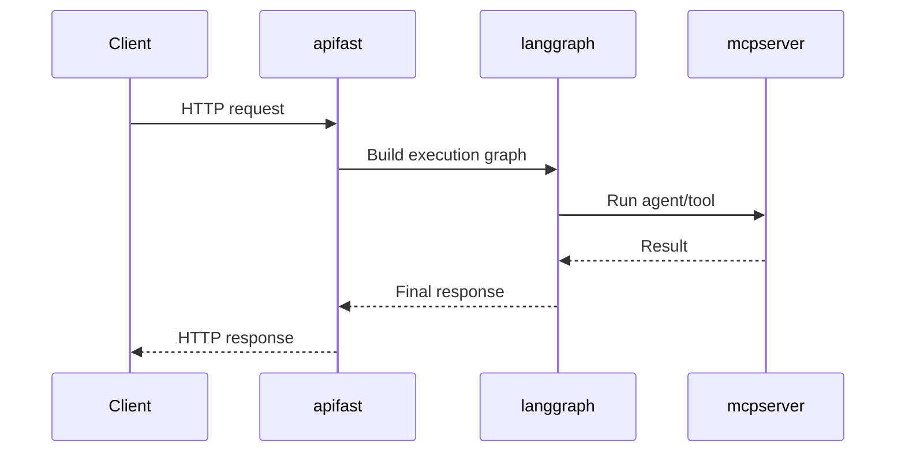

```mermaid
flowchart LR
    subgraph ZENA["Root Repo: zena"]
        DC[docker-compose.yml]
        MK[Makefile]
    end

    subgraph APIFAST["apifast (submodule)"]
        API[FastAPI / HTTP API]
    end

    subgraph LANGGRAPH["langgraph (submodule)"]
        LG[Graph / Orchestration]
    end

    subgraph MCPSERVER["mcpserver (submodule)"]
        MCP[Agents / MCP / Tools]
    end

    DC --> APIFAST
    DC --> LANGGRAPH
    DC --> MCPSERVER

    APIFAST --> LANGGRAPH
    APIFAST --> MCP
```

```mermaid
sequenceDiagram
    Client->>apifast: HTTP request
    apifast->>langgraph: Build execution graph
    langgraph->>mcpserver: Run agent/tool
    mcpserver-->>langgraph: Result
    langgraph-->>apifast: Final response
    apifast-->>Client: HTTP response
```